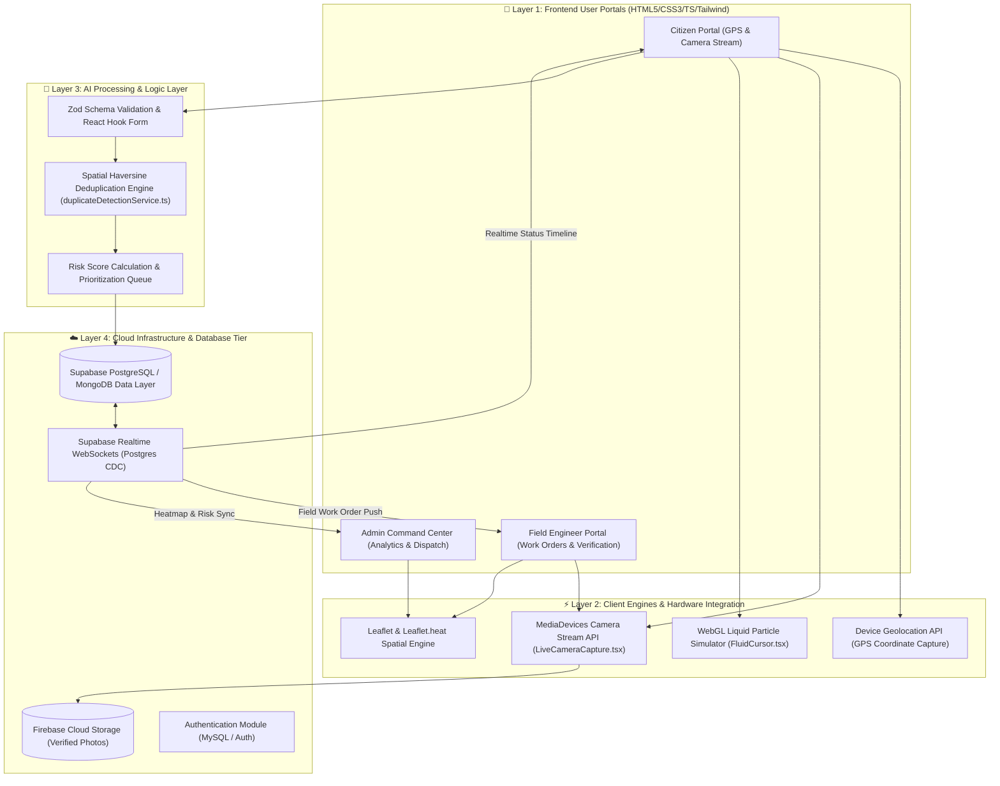
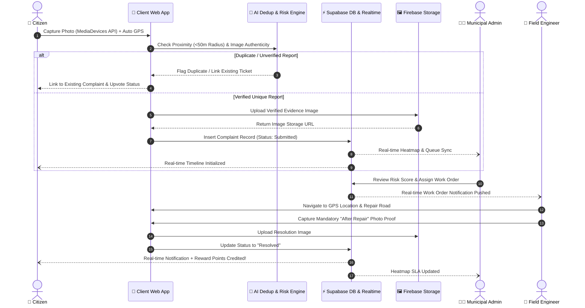

<div style="text-align: center;">

  <h1>🛣️ Aapno Rasto (આપણો રસ્તો)</h1>
  <p><strong>AI-Driven Integrated Urban Resilience & Civic Infrastructure Management System</strong></p>
  <p><em>Developed for Government of Gujarat • ImpactThon @ KSV 2025–2026 (Track 3: Technology for Social Good & Sustainable Progress)</em></p>

  <p>
    <a href="https://aapno-rasto.vercel.app"><strong>🌐 Explore Live Platform</strong></a> •
    <a href="https://github.com/Parthh1002/Aapno-Rasto"><strong>🐙 GitHub Repository</strong></a> •
    <a href="TEAM%20N%2B1'S%20IMPACTHON.pdf"><strong>📄 Download Official Presentation PDF</strong></a>
  </p>

  <p>
    <a href="https://aapno-rasto.vercel.app"></a>
    <a href="https://github.com/Parthh1002/Aapno-Rasto"></a>
    <a href="#-team-n1s--contributor-hall-of-fame"></a>
    <a href="TEAM%20N%2B1'S%20IMPACTHON.pdf"></a>
  </p>

</div>

---

## 📌 Executive Summary

**Aapno Rasto** (આપણો રસ્તો) is an AI-driven, enterprise-grade civic issue resolution and urban resilience system built by **Team N+1's** from **LDRP Institute of Technology and Research (LDRP-ITR), Kadi Sarva Vishwavidyalaya (KSV)**. Designed for the **Government of Gujarat**, the platform unifies municipal road safety management into a single transparent ecosystem.

By combining real-time hardware GPS pinpointing and native camera verification with AI-assisted duplicate detection, risk-based prioritization, and real-time WebSocket state synchronization, **Aapno Rasto** eliminates municipal silos, prevents budget waste, and accelerates road infrastructure repair cycles.

---

## 📄 Official Presentation PDF: [`TEAM N+1'S IMPACTHON.pdf`](TEAM%20N%2B1'S%20IMPACTHON.pdf)

> 📥 **Direct Presentation Download**: [`TEAM N+1'S IMPACTHON.pdf`](TEAM%20N%2B1'S%20IMPACTHON.pdf)  
> 🌐 **Live Web Application**: [https://aapno-rasto.vercel.app](https://aapno-rasto.vercel.app)

Below is the **complete page-by-page breakdown** of our official ImpactThon presentation deck:

---

### 📑 Page-by-Page Presentation Breakdown

#### 📍 Slide 1: Title & Event Metadata
- **Track Number**: Track 3
- **Track Title**: Technology for Social Good & Sustainable Progress
- **Project Title**: AI-Driven Integrated Urban Resilience System (**Aapno Rasto**)
- **Event**: ImpactThon @ KSV 2025 – 2026
- **Team ID**: `ID_5_N+1's` | **Team Name**: `N+1's`
- **Institute Name**: LDRP Institute of Technology and Research (LDRP-ITR), Kadi Sarva Vishwavidyalaya (KSV)

---

#### 👥 Slide 2: Team Roster & Governance
- **Siddharth Trivedi** — Team Leader (`24BECE30657`, CE, LDRP-ITR, KSV)
- **Parth Patel** — Co-Team Leader & Lead Architect (`24BECE30597`, CE, LDRP-ITR, KSV)
- **Rutva Trivedi** — Team Member (`24BECE30656`, CE, LDRP-ITR, KSV)
- **Dhruv Upadhyay** — Team Member (`24BECE30658`, CE, LDRP-ITR, KSV)
- **Dr. Avani Dadhania** — Faculty Guide (CE, LDRP-ITR, KSV)

---

#### 💡 Slide 3: Core Idea & Problem vs. Solution
- **The Core Idea**: A unified AI-powered civic platform where citizens report road and public safety issues using real-time photos and GPS coordinates. Reports are intelligently verified, prioritized, and displayed on a centralized dashboard for swift municipal action.
- **Key Problems Identified**:
  1. Urban civic services operate on multiple disconnected (siloed) platforms.
  2. Citizens must use different portals to report basic road safety issues.
  3. Delayed response and poor inter-departmental coordination.
  4. Lack of real-time, location-verified data leads to unsafe roads.
- **Proposed Solution**:
  1. One unified AI-powered platform to manage all public safety hazards.
  2. Easy citizen reporting via live camera photos/videos with auto GPS location.
  3. AI-based verification to filter genuine reports, remove duplicates, and rank issues.
  4. Transparent issue lifecycle: `Submitted → Verified → Assigned → In Progress → Resolved`.
  5. Centralized authority dashboard with map-based insights for faster action.

---

#### 🛠️ Slide 4: Technical Approach & Layer Stack
- **Frontend Layer**: HTML5 structure, CSS3 styling & responsive layouts (Tailwind CSS), JavaScript interactive user experience, Camera & GPS API for image capture and coordinates.
- **Backend Server Side**: Node.js runtime, Express.js API handling and routing, REST APIs for frontend-backend communication, Authentication module for secure access.
- **Database Layer**:
  - **MongoDB**: Stores complaint data, image metadata, and GPS location pairs.
  - **MySQL**: Stores user profiles, authority/officer details, and authentication records.
- **AI / Processing Layer**: JavaScript-based AI integration, Image Authenticity Verification, Duplicate Image & False Location Detection, Risk Score Calculation.

---

#### 🏛️ Slide 5: Architecture & Website Workflow
- **Architecture Flowchart**:
  - **Frontend Layer**: Home Page, User Login, Report Issue Page, Map View, Complaint Status, Profile & History, Notifications, Points System.
  - **Backend Application**: Express.js / Node.js REST APIs (Auth, Complaint Mgmt, Image Upload, Location, Real-Time Map, Gamification).
  - **Middle Layer**: AI Engine (Image Analysis, Auto Categorization, Risk Score, Duplicate Detection) & Map Analytics (Google Maps Integration, Risk Score Map, Area Statistics).
  - **Database Layer**: MongoDB / MySQL (Users, Complaints, Media, Locations, Feedback & Points).
  - **Government Dashboard**: Admin Login, Dept-wise Issues, Priority Queue, Task Assignment, Status Updates, Analytics & Reports.
  - **Notifications Layer**: Issue Solved, Current Issues, Road Alerts, Live Tracking.
- **Website Workflow Lifecycle**:
  - `Login/Sign In` → `Report Issue (Photo + GPS)` → `AI Verification & Duplication Check` → `Categorization & Prioritization` → `Send to Relevant Dept` → `Assign to Field Technician` → `Status: Pending -> In Progress` → `Update Status (Photos) -> Marked Resolved` → `Resolve & Close Ticket`.

---

#### ⚡ Slide 6: Feasibility, Viability & Challenges
- **Feasibility**:
  - Uses existing web, AI, and map technologies.
  - Works with camera & GPS already available on standard smartphones.
  - Highly scalable architecture: `Ward → City → State`.
- **Viability**:
  - AI verification & duplicate detection eliminate wasteful manual audits.
  - Risk-based prioritization ensures immediate attention to critical black spots.
  - Transparent issue tracking builds strong citizen trust in government action.
- **Challenges Addressed**:
  - Fake or duplicate issue reports (resolved via AI photo & spatial deduplication).
  - Delays in authority response (resolved via automated SLA routing & escalation).
  - Data privacy & user trust (resolved via encrypted auth modules and anonymized data).

---

#### 🌟 Slide 7: Impact and Benefits
- **Technical Edge**: AI verifies real damage and filters fake or AI-generated images; automated risk scoring prioritizes high-traffic danger zones; multi-language support (English/Gujarati) ensures inclusivity.
- **Government Efficiency**: Smart governance that conducts road audits faster, saves manpower, prevents budget waste through duplicate detection, and enforces SLA accountability.
- **Social Impact**: Saves lives on roads, prevents two-wheeler accidents by early pothole detection, improves pedestrian safety, and uses historical data to predict accident black spots.

---

#### 📊 Slide 8: Platform Comparison Matrix
- Comprehensive comparison evaluating **Aapno Rasto** against **Existing Department Portals** and **Manual Helpline Systems** across 9 key criteria.

---

## 📈 Detailed Comparison Matrix (Slide 8 Data)

| Feature / Criteria | Proposed Unified Platform (Aapno Rasto) | Existing Department Portals | Manual / Helpline-Based Systems |
| :--- | :--- | :--- | :--- |
| **Single Unified Platform** | **Yes** — All departments integrated | **No** — Separate portals per department | **No** — Disconnected helplines |
| **Issue Classification** | **Automated** using AI rules | Manual category selection | Manual intake |
| **Risk-Based Prioritization** | **Built-in** hazard severity scoring | Not available | Not available |
| **Cross-Department Coordination** | **Centralized** workflow management | Limited or absent | Not available |
| **Real-Time Status Tracking** | **End-to-end** live tracking & alerts | Partial visibility | Not supported |
| **Duplicate Complaint Detection** | **Automated** spatial & image check | Not supported | Not available |
| **Analytics & Hazard Heatmaps** | **State-level** insights & heatmaps | Not available | Not available |
| **SLA-Based Accountability** | **Automated** SLA tracking & escalation | Mostly manual | Not defined |
| **Response Time** | **Fast & Automated** | Moderate | Slow |

---

## 📐 System Architecture & Workflow Diagrams

### 1. High-Level Multi-Tier System Architecture



---

### 2. End-to-End Issue Lifecycle Sequence



---

## ⚡ Key Architectural Techniques & Code Implementation

- **WebGL Liquid Fluid Simulation**: Implemented in [`src/components/FluidCursor.tsx`](src/components/FluidCursor.tsx) using [HTMLCanvasElement.getContext()](https://developer.mozilla.org/en-US/docs/Web/API/HTMLCanvasElement/getContext) WebGL rendering context for GPU-accelerated liquid particle physics.
- **Native Hardware Media Capture Integration**: Direct camera stream control in [`src/components/LiveCameraCapture.tsx`](src/components/LiveCameraCapture.tsx) built using the browser's [MediaDevices.getUserMedia()](https://developer.mozilla.org/en-US/docs/Web/API/MediaDevices/getUserMedia) API.
- **Geospatial Duplicate Detection Engine**: Spatial deduplication logic in [`src/services/duplicateDetectionService.ts`](src/services/duplicateDetectionService.ts) and [`src/hooks/useDuplicateDetection.ts`](src/hooks/useDuplicateDetection.ts) executing Haversine equations against active coordinates.
- **Device Geolocation Acquisition**: Location acquisition in [`src/pages/CitizenDashboard.tsx`](src/pages/CitizenDashboard.tsx) using the native [Geolocation API](https://developer.mozilla.org/en-US/docs/Web/API/Geolocation_API) (`navigator.geolocation.getCurrentPosition`).
- **WebSocket Real-Time Synchronization**: Live state updates in [`src/hooks/useComplaintsRealtime.ts`](src/hooks/useComplaintsRealtime.ts) leveraging the [WebSocket API](https://developer.mozilla.org/en-US/docs/Web/API/WebSocket_API) via Supabase Realtime channels.
- **Hardware-Accelerated CSS Layering**: GPU isolation in [`src/index.css`](src/index.css) using [`will-change`](https://developer.mozilla.org/en-US/docs/Web/CSS/will-change) and 3D GPU layer transforms (`transform: translateZ(0)`), with native [scroll-behavior](https://developer.mozilla.org/en-US/docs/Web/CSS/scroll-behavior).

---

## 🛠️ Tech Stack & Ecosystem

### Frontend Core & UI Frameworks
| Technology / Library | Purpose | Link |
| :--- | :--- | :--- |
| **React 18** | UI Component Architecture | [react.dev](https://react.dev/) |
| **TypeScript** | Static Type Safety & Interfaces | [typescriptlang.org](https://www.typescriptlang.org/) |
| **Vite** | Next-Gen Frontend Tooling | [vitejs.dev](https://vitejs.dev/) |
| **Tailwind CSS** | Utility-First Styling Engine | [tailwindcss.com](https://tailwindcss.com/) |
| **Radix UI** | Accessible Unstyled Component Primitives | [radix-ui.com](https://www.radix-ui.com/) |
| **Framer Motion** | Declarative Animation Engine | [framer.com/motion](https://www.framer.com/motion/) |
| **Lucide React** | Scalable Vector Icon Suite | [lucide.dev](https://lucide.dev/) |

### Data, Mapping & State Management
| Technology / Library | Purpose | Link |
| :--- | :--- | :--- |
| **Leaflet & Leaflet.heat** | Interactive Maps & Spatial Heatmaps | [leafletjs.com](https://leafletjs.com/) • [Leaflet.heat](https://github.com/Leaflet/Leaflet.heat) |
| **React Leaflet** | React Bindings for Leaflet Maps | [react-leaflet.js.org](https://react-leaflet.js.org/) |
| **Supabase JS Client** | Real-time PostgreSQL Backend & CDC | [supabase.com](https://supabase.com/docs/reference/javascript/introduction) |
| **Firebase SDK** | Cloud Storage & Auth Services | [firebase.google.com](https://firebase.google.com/) |
| **TanStack React Query** | Asynchronous Server State & Caching | [tanstack.com/query](https://tanstack.com/query/latest) |
| **Recharts** | Composability SVG Analytics Charts | [recharts.org](https://recharts.org/) |
| **Zod & React Hook Form** | Type-Safe Form Validation Engine | [zod.dev](https://zod.dev/) • [react-hook-form.com](https://react-hook-form.com/) |

### Typography & Fonts
- **Poppins**: Primary sans-serif interface font — [Google Fonts: Poppins](https://fonts.google.com/specimen/Poppins)
- **Noto Sans Gujarati**: Regional script font for Gujarati language support — [Google Fonts: Noto Sans Gujarati](https://fonts.google.com/specimen/Noto+Sans+Gujarati)

---

## 📁 Repository Structure

```text
Aapno-Rasto/
├── backend/                  # Server-side APIs and database helper scripts
├── public/                   # Static assets, web app manifest, icons
├── src/
│   ├── assets/               # Branding graphics and local assets
│   ├── components/           # UI Components
│   │   ├── admin/            # Admin analytics & work assignment views
│   │   ├── citizen/          # Citizen complaint reporting components
│   │   ├── engineer/         # Field engineer update & photo proof modals
│   │   └── ui/               # Reusable Radix + Tailwind design primitives
│   ├── contexts/             # Global React Context providers
│   ├── hooks/                # Custom React hooks (real-time sync, location, camera)
│   ├── lib/                  # Client instantiations (Supabase, Firebase)
│   ├── pages/                # Main application route views
│   ├── services/             # Domain logic (duplicate detection, spatial math)
│   ├── test/                 # Component & utility test suites
│   ├── types/                # TypeScript interface definitions
│   └── utils/                # Helper functions and formatters
├── supabase/                 # Supabase migrations, rules & schemas
├── TEAM N+1'S IMPACTHON.pdf  # Official ImpactThon presentation deck
├── components.json           # shadcn component configuration
├── eslint.config.js          # ESLint rules configuration
├── firestore.rules           # Firebase Firestore security rules
├── index.html                # App entry document with meta tags
├── package.json              # Dependencies and build scripts
├── postcss.config.js         # PostCSS configuration
├── storage.rules             # Firebase Cloud Storage security rules
├── tailwind.config.ts        # Design system theme configuration
├── tsconfig.json             # TypeScript compiler settings
├── vercel.json               # Vercel routing & CORS headers
└── vite.config.ts            # Vite build configuration
```

### Module Overview
- [`src/components/`](src/components/): Modular UI components separated into `admin`, `citizen`, `engineer`, and `ui` design system primitives.
- [`src/hooks/`](src/hooks/): Real-time Supabase channels, duplicate detection subscriptions, camera controls, and work order tracking custom hooks.
- [`src/services/`](src/services/): Core domain logic for spatial distance calculations and duplicate complaint filtering.
- [`src/lib/`](src/lib/): Firebase authentication, Cloud Storage buckets, and Supabase client initialization files.
- [`src/pages/`](src/pages/): Full page views for the Citizen Portal, Field Engineer Workstation, Admin Command Center, and Landing Page.

---

## 👥 Team N+1's & Contributor Hall of Fame

Developed by **Team N+1's** at **LDRP Institute of Technology and Research (LDRP-ITR), KSV**:

<table>
  <tr>
    <td style="text-align: center; width: 20%;">
      <a href="https://github.com/Parthh1002">
        <br />
        <sub><b>Parth Patel</b></sub>
      </a><br />
      <small>Co-Team Leader & Lead Architect</small><br />
      <code>24BECE30597</code>
    </td>
    <td style="text-align: center; width: 20%;">
      <a href="#">
        <br />
        <sub><b>Siddharth Trivedi</b></sub>
      </a><br />
      <small>Team Leader & Lead Developer</small><br />
      <code>24BECE30657</code>
    </td>
    <td style="text-align: center; width: 20%;">
      <a href="#">
        <br />
        <sub><b>Rutva Trivedi</b></sub>
      </a><br />
      <small>Team Member</small><br />
      <code>24BECE30656</code>
    </td>
    <td style="text-align: center; width: 20%;">
      <a href="#">
        <br />
        <sub><b>Dhruv Upadhyay</b></sub>
      </a><br />
      <small>Team Member</small><br />
      <code>24BECE30658</code>
    </td>
    <td style="text-align: center; width: 20%;">
      <a href="#">
        <br />
        <sub><b>Dr. Avani Dadhania</b></sub>
      </a><br />
      <small>Project Guide</small><br />
      <small>CE, LDRP-ITR</small>
    </td>
  </tr>
</table>

---

<div style="text-align: center;">
  <p>© ImpactThon @ KSV • Government of Gujarat Civic Tech Initiative • Built by Team N+1's (LDRP-ITR)</p>
</div>
