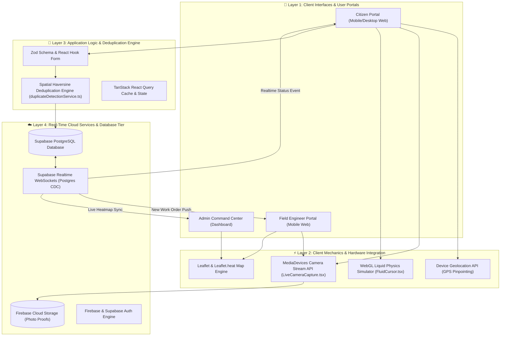
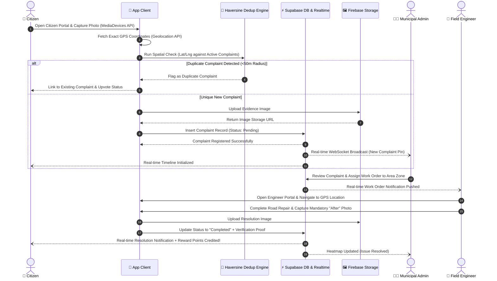

<div align="center">

  <h1>🛣️ Aapno Rasto (આપણો રસ્તો)</h1>
  <p><strong>Government of Gujarat — Smart Civic Infrastructure & Complaint Management Platform</strong></p>

  <p>
    <a href="https://aapno-rasto.vercel.app"><strong>🌐 Explore Live Platform</strong></a> •
    <a href="https://github.com/Parthh1002/Aapno-Rasto"><strong>🐙 GitHub Repository</strong></a> •
    <a href="#-project-presentation--slide-deck"><strong>📊 View Slide Deck</strong></a>
  </p>

  <p>
    <a href="https://aapno-rasto.vercel.app"></a>
    <a href="https://github.com/Parthh1002/Aapno-Rasto"></a>
    <a href="#-core-creators"></a>
    
  </p>

</div>

---

## 📌 Executive Summary

**Aapno Rasto** (આપણો રસ્તો) is a next-generation, high-performance civic issue resolution and infrastructure monitoring platform engineered for the **Government of Gujarat**. Conceived, architected, and full-stack developed by **Parth** and **Siddharth**, the platform digitizes municipal governance, connects citizens with local authorities, and automates field engineering workflows in real time.

By coupling hardware geolocation and native camera stream verification with real-time WebSocket state synchronization and spatial heatmap visualization, **Aapno Rasto** eliminates municipal bottlenecks, prevents duplicate complaint logging, and drastically speeds up road repair resolution cycles.

---

## 📐 System Architecture & Workflow Diagrams

### 1. High-Level 3D/2D Layered System Architecture



---

### 2. End-to-End Civic Issue Lifecycle Workflow



---

## 📊 Platform Impact & Feature Matrix

<table>
  <tr>
    <th width="33%">🏛️ Citizen Portal</th>
    <th width="33%">👷 Field Engineer Portal</th>
    <th width="33%">🎯 Admin Command Center</th>
  </tr>
  <tr>
    <td valign="top">
      <ul>
        <li><strong>Geo-Tagged Reporting:</strong> Pinpoint exact pothole/road damage location using device GPS.</li>
        <li><strong>Live Camera Capture:</strong> Native hardware camera integration preventing image tamper/fake uploads.</li>
        <li><strong>Reward System:</strong> Gamified civic points for active community reporting.</li>
        <li><strong>Status Timeline:</strong> Real-time resolution notifications and status milestones.</li>
      </ul>
    </td>
    <td valign="top">
      <ul>
        <li><strong>Work Order Queue:</strong> Dynamic assignment of repair tasks based on geographical zone.</li>
        <li><strong>Before/After Proof:</strong> Mandatory multi-stage photo verification upon completion.</li>
        <li><strong>Field Navigation:</strong> Integrated map routes to assigned infrastructure issue coordinates.</li>
        <li><strong>Instant Status Sync:</strong> Direct field update sync to administration servers.</li>
      </ul>
    </td>
    <td valign="top">
      <ul>
        <li><strong>Spatial Heatmap:</strong> Leaflet density layers pinpointing high-density complaint clusters.</li>
        <li><strong>Duplicate Detection:</strong> Haversine spatial radius filtering identifying duplicate submissions.</li>
        <li><strong>Analytics Dashboard:</strong> Recharts analytics monitoring resolution throughput and SLA timings.</li>
        <li><strong>Work Allocation:</strong> Automated engineer dispatching and status overrides.</li>
      </ul>
    </td>
  </tr>
</table>

---

## ⚡ Key Architectural Techniques & Engineering Mechanics

### 1. WebGL Liquid Fluid Simulation
The application features a custom WebGL liquid particle physics cursor simulation implemented in [`src/components/FluidCursor.tsx`](src/components/FluidCursor.tsx). Using the [HTMLCanvasElement.getContext()](https://developer.mozilla.org/en-US/docs/Web/API/HTMLCanvasElement/getContext) WebGL rendering context, velocity and density fields are computed on the GPU for zero-lag fluid dynamic interactions across desktop viewports.

### 2. Native Hardware Media Capture Integration
Direct device camera stream control is managed in [`src/components/LiveCameraCapture.tsx`](src/components/LiveCameraCapture.tsx) via the browser's [MediaDevices.getUserMedia()](https://developer.mozilla.org/en-US/docs/Web/API/MediaDevices/getUserMedia) API. Video constraints, stream initialization, fallback handling, and image frame extraction are handled asynchronously without external wrapper libraries.

### 3. Geospatial Duplicate Detection Engine
To eliminate redundant municipal work orders, [`src/services/duplicateDetectionService.ts`](src/services/duplicateDetectionService.ts) and [`src/hooks/useDuplicateDetection.ts`](src/hooks/useDuplicateDetection.ts) implement Haversine distance calculations across active database coordinates. Complaints falling within predefined spatial radiuses (e.g. 50m) are automatically flagged as duplicate entries prior to storage.

### 4. Device Geolocation Acquisition
Real-time coordinate pinpointing is managed in [`src/pages/CitizenDashboard.tsx`](src/pages/CitizenDashboard.tsx) using the native [Geolocation API](https://developer.mozilla.org/en-US/docs/Web/API/Geolocation_API) (`navigator.geolocation.getCurrentPosition`). It provides high-accuracy coordinate fallback strategies and error boundary handling for mobile browsers.

### 5. WebSocket Real-Time Synchronization
Live complaint tracking and notification streams in [`src/hooks/useComplaintsRealtime.ts`](src/hooks/useComplaintsRealtime.ts) utilize PostgreSQL change data capture via the [WebSocket API](https://developer.mozilla.org/en-US/docs/Web/API/WebSocket_API) (Supabase Realtime channels). Updates to complaint states instantly reflect on citizen feeds and engineer queues without page reloads.

### 6. Hardware-Accelerated CSS Layering & Smooth Navigation
The design system in [`src/index.css`](src/index.css) leverages GPU compositor layer isolation through the [`will-change`](https://developer.mozilla.org/en-US/docs/Web/CSS/will-change) property and 3D transform matrices (`transform: translateZ(0)`), completely avoiding layout recalculation during heavy animations. In-page navigation utilizes native [scroll-behavior](https://developer.mozilla.org/en-US/docs/Web/CSS/scroll-behavior) for smooth scrolling transitions.

---

## 🛠️ Tech Stack & Ecosystem

### Frontend Core & UI Frameworks
| Technology / Library | Purpose | Link |
| :--- | :--- | :--- |
| **React 18** | UI Component Architecture | [react.dev](https://react.dev/) |
| **TypeScript** | Static Type Safety & Interfaces | [typescriptlang.org](https://www.typescriptlang.org/) |
| **Vite** | Modern Next-Gen Frontend Tooling | [vitejs.dev](https://vitejs.dev/) |
| **Tailwind CSS** | Utility-First CSS Framework | [tailwindcss.com](https://tailwindcss.com/) |
| **Radix UI** | Accessible Unstyled Component Primitives | [radix-ui.com](https://www.radix-ui.com/) |
| **Framer Motion** | Declarative Animation Engine | [framer.com/motion](https://www.framer.com/motion/) |
| **Lucide React** | Scalable Vector Icons | [lucide.dev](https://lucide.dev/) |

### Data, Mapping & State Management
| Technology / Library | Purpose | Link |
| :--- | :--- | :--- |
| **Leaflet** | Interactive Open-Source Maps | [leafletjs.com](https://leafletjs.com/) |
| **Leaflet.heat** | Spatial Heatmap Layer Engine | [github.com/Leaflet/Leaflet.heat](https://github.com/Leaflet/Leaflet.heat) |
| **React Leaflet** | React Bindings for Leaflet Maps | [react-leaflet.js.org](https://react-leaflet.js.org/) |
| **Supabase JS Client** | Real-time PostgreSQL Backend & Auth | [supabase.com](https://supabase.com/docs/reference/javascript/introduction) |
| **Firebase SDK** | Cloud Storage & Auth Integration | [firebase.google.com](https://firebase.google.com/) |
| **TanStack React Query** | Server State Management & Caching | [tanstack.com/query](https://tanstack.com/query/latest) |
| **Recharts** | Composability SVG Analytics Charts | [recharts.org](https://recharts.org/) |
| **Zod & React Hook Form** | Type-Safe Form Validation | [zod.dev](https://zod.dev/) • [react-hook-form.com](https://react-hook-form.com/) |

### Typography & Fonts
- **Poppins**: Primary sans-serif font family used across application layout — [Google Fonts: Poppins](https://fonts.google.com/specimen/Poppins)
- **Noto Sans Gujarati**: Native font family for regional Gujarati text support — [Google Fonts: Noto Sans Gujarati](https://fonts.google.com/specimen/Noto+Sans+Gujarati)

---

## 📁 Repository Structure

```text
Aapno-Rasto/
├── backend/                  # Server-side APIs and database helper scripts
├── public/                   # Static assets, web app manifest, icons
├── src/
│   ├── assets/               # Branding graphics and local assets
│   ├── components/           # UI Components
│   │   ├── admin/            # Admin analytics & work assignment views
│   │   ├── citizen/          # Citizen complaint reporting components
│   │   ├── engineer/         # Field engineer update & photo proof modals
│   │   └── ui/               # Reusable Radix + Tailwind design primitives
│   ├── contexts/             # Global React Context providers
│   ├── hooks/                # Custom React hooks (real-time sync, location, camera)
│   ├── lib/                  # Client instantiations (Supabase, Firebase)
│   ├── pages/                # Main application route views
│   ├── services/             # Domain logic (duplicate detection, spatial math)
│   ├── test/                 # Component & utility test suites
│   ├── types/                # TypeScript interface definitions
│   └── utils/                # Helper functions and formatters
├── supabase/                 # Supabase migrations, rules & schemas
├── components.json           # shadcn component configuration
├── eslint.config.js          # ESLint rules configuration
├── firestore.rules           # Firebase Firestore security rules
├── index.html                # App entry document with meta tags
├── package.json              # Dependencies and build scripts
├── postcss.config.js         # PostCSS configuration
├── storage.rules             # Firebase Cloud Storage security rules
├── tailwind.config.ts        # Design system theme configuration
├── tsconfig.json             # TypeScript compiler settings
├── vercel.json               # Vercel routing & CORS headers
└── vite.config.ts            # Vite build configuration
```

### Module Descriptions
- [`src/components/`](src/components/): Modular UI components partitioned into `admin`, `citizen`, `engineer`, and `ui` design system primitives.
- [`src/hooks/`](src/hooks/): Real-time Supabase channels, duplicate detection subscriptions, camera controls, and work order tracking custom hooks.
- [`src/services/`](src/services/): Core backend abstraction layers and spatial distance calculations for issue deduplication.
- [`src/lib/`](src/lib/): Firebase authentication, Cloud Storage buckets, and Supabase client initialization files.
- [`src/pages/`](src/pages/): Full page views for the Citizen Portal, Field Engineer Workstation, Admin Command Center, and Landing Page.

---

## 📽️ Project Presentation & Slide Deck

Access the full project deck, system architecture diagrams, and municipal workflow presentation:

> 📁 **Slide Deck File**: [`docs/presentation.pptx`](docs/presentation.pptx) *(Or view the online presentation)*  
> 🌐 **Live Demonstration**: [https://aapno-rasto.vercel.app](https://aapno-rasto.vercel.app)

---

## 👥 Core Creators & Lead Architects

**Aapno Rasto** was conceived, designed, and built entirely by:

<table>
  <tr>
    <td align="center" width="50%">
      <a href="https://github.com/Parthh1002">
        <br />
        <sub><b>Parth</b></sub>
      </a><br />
      <p>🚀 <strong>Lead Architect & Full Stack Engineer</strong></p>
      <a href="https://github.com/Parthh1002"><code>@Parthh1002</code></a>
    </td>
    <td align="center" width="50%">
      <a href="#">
        <br />
        <sub><b>Siddharth</b></sub>
      </a><br />
      <p>💡 <strong>Co-Creator & Lead Developer</strong></p>
      <a href="#"><code>Co-Creator</code></a>
    </td>
  </tr>
</table>

---

<div align="center">
  <p>© Government of Gujarat Civic Tech Initiative • Built by Parth & Siddharth</p>
</div>
